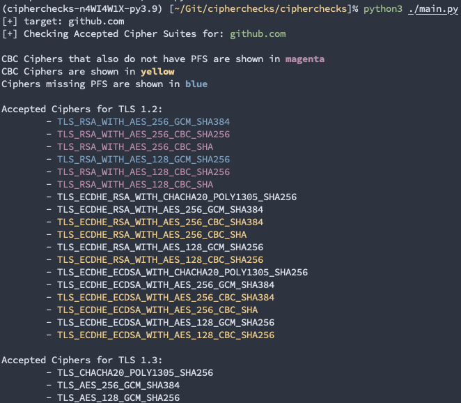

# chipherchecks
visually see issues with supported cipher suites

Theres a few known tools out there that will check the cipher suites accepted by a system. This is my attempt in making the output of the results more readable. 

For example, using [sslscan](https://github.com/rbsec/sslscan/), to only have a list of supported ciphers, your'll need to grep for 'Accepted'.

```bash
$ sslscan github.com | grep Accepted
Accepted  TLSv1.3  256 bits  TLS_CHACHA20_POLY1305_SHA256  Curve 25519 DHE 253
Accepted  TLSv1.3  256 bits  TLS_AES_256_GCM_SHA384        Curve 25519 DHE 253
Accepted  TLSv1.2  128 bits  ECDHE-RSA-AES128-GCM-SHA256   Curve 25519 DHE 253
Accepted  TLSv1.2  256 bits  ECDHE-ECDSA-CHACHA20-POLY1305 Curve 25519 DHE 253
Accepted  TLSv1.2  256 bits  ECDHE-RSA-CHACHA20-POLY1305   Curve 25519 DHE 253
Accepted  TLSv1.2  256 bits  ECDHE-ECDSA-AES256-GCM-SHA384 Curve 25519 DHE 253
Accepted  TLSv1.2  256 bits  ECDHE-RSA-AES256-GCM-SHA384   Curve 25519 DHE 253
Accepted  TLSv1.2  128 bits  ECDHE-ECDSA-AES128-SHA256     Curve 25519 DHE 253
Accepted  TLSv1.2  128 bits  ECDHE-RSA-AES128-SHA256       Curve 25519 DHE 253
Accepted  TLSv1.2  256 bits  ECDHE-ECDSA-AES256-SHA384     Curve 25519 DHE 253
Accepted  TLSv1.2  256 bits  ECDHE-RSA-AES256-SHA384       Curve 25519 DHE 253
Accepted  TLSv1.2  256 bits  ECDHE-ECDSA-AES256-SHA        Curve 25519 DHE 253
Accepted  TLSv1.2  256 bits  ECDHE-RSA-AES256-SHA          Curve 25519 DHE 253
Accepted  TLSv1.2  128 bits  AES128-GCM-SHA256
Accepted  TLSv1.2  256 bits  AES256-GCM-SHA384
Accepted  TLSv1.2  128 bits  AES128-SHA256
Accepted  TLSv1.2  256 bits  AES256-SHA256
Accepted  TLSv1.2  128 bits  AES128-SHA
Accepted  TLSv1.2  256 bits  AES256-SHA
```

[testssl.sh](https://github.com/drwetter/testssl.sh) does way more than just listing the accepted ciphers, however the output of that is skued too.

```bash
$ testssl -E github.com

...snip...

Hexcode  Cipher Suite Name (OpenSSL)       KeyExch.   Encryption  Bits     Cipher Suite Name (IANA/RFC)
-----------------------------------------------------------------------------------------------------------------------------
SSLv2
SSLv3
TLS 1
TLS 1.1
TLS 1.2
 xc030   ECDHE-RSA-AES256-GCM-SHA384       ECDH 253   AESGCM      256      TLS_ECDHE_RSA_WITH_AES_256_GCM_SHA384
 xc02c   ECDHE-ECDSA-AES256-GCM-SHA384     ECDH 253   AESGCM      256      TLS_ECDHE_ECDSA_WITH_AES_256_GCM_SHA384
 xc028   ECDHE-RSA-AES256-SHA384           ECDH 253   AES         256      TLS_ECDHE_RSA_WITH_AES_256_CBC_SHA384
 xc024   ECDHE-ECDSA-AES256-SHA384         ECDH 253   AES         256      TLS_ECDHE_ECDSA_WITH_AES_256_CBC_SHA384
 xc014   ECDHE-RSA-AES256-SHA              ECDH 253   AES         256      TLS_ECDHE_RSA_WITH_AES_256_CBC_SHA
 xc00a   ECDHE-ECDSA-AES256-SHA            ECDH 253   AES         256      TLS_ECDHE_ECDSA_WITH_AES_256_CBC_SHA
 xcca9   ECDHE-ECDSA-CHACHA20-POLY1305     ECDH 253   ChaCha20    256      TLS_ECDHE_ECDSA_WITH_CHACHA20_POLY1305_SHA256
 xcca8   ECDHE-RSA-CHACHA20-POLY1305       ECDH 253   ChaCha20    256      TLS_ECDHE_RSA_WITH_CHACHA20_POLY1305_SHA256
 x9d     AES256-GCM-SHA384                 RSA        AESGCM      256      TLS_RSA_WITH_AES_256_GCM_SHA384
 x3d     AES256-SHA256                     RSA        AES         256      TLS_RSA_WITH_AES_256_CBC_SHA256
 x35     AES256-SHA                        RSA        AES         256      TLS_RSA_WITH_AES_256_CBC_SHA
 xc02f   ECDHE-RSA-AES128-GCM-SHA256       ECDH 253   AESGCM      128      TLS_ECDHE_RSA_WITH_AES_128_GCM_SHA256
 xc02b   ECDHE-ECDSA-AES128-GCM-SHA256     ECDH 253   AESGCM      128      TLS_ECDHE_ECDSA_WITH_AES_128_GCM_SHA256
 xc027   ECDHE-RSA-AES128-SHA256           ECDH 253   AES         128      TLS_ECDHE_RSA_WITH_AES_128_CBC_SHA256
 xc023   ECDHE-ECDSA-AES128-SHA256         ECDH 253   AES         128      TLS_ECDHE_ECDSA_WITH_AES_128_CBC_SHA256
 x9c     AES128-GCM-SHA256                 RSA        AESGCM      128      TLS_RSA_WITH_AES_128_GCM_SHA256
 x3c     AES128-SHA256                     RSA        AES         128      TLS_RSA_WITH_AES_128_CBC_SHA256
 x2f     AES128-SHA                        RSA        AES         128      TLS_RSA_WITH_AES_128_CBC_SHA
TLS 1.3
 x1302   TLS_AES_256_GCM_SHA384            ECDH 253   AESGCM      256      TLS_AES_256_GCM_SHA384
 x1303   TLS_CHACHA20_POLY1305_SHA256      ECDH 253   ChaCha20    256      TLS_CHACHA20_POLY1305_SHA256
 x1301   TLS_AES_128_GCM_SHA256            ECDH 253   AESGCM      128      TLS_AES_128_GCM_SHA256

 Done 2021-07-14 07:37:53 [  12s] -->> 140.82.121.4:443 (github.com) <<--
```

This _tool_ attempts to make the output of the accepted ciphers a little more copy & paste'able.



# installation 

```bash
pip3 install cipherchecks
```

## license

`cipherchecks` is licensed under a [GNU General Public v3 License](https://www.gnu.org/licenses/gpl-3.0.en.html). Permissions beyond the scope of this license may be available at [http://sensepost.com/contact/](http://sensepost.com/contact/).
